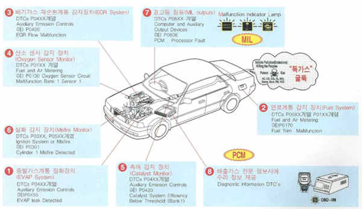

# Awesome CAN(Controller Area Network) (DevGun) 🇰🇷

    

 

## Table of Contents

- OBD (On Board Diagnostics)
- Reference Paper
  - (2021) WINDS_A Wavelet-Based Intrusion Detection System for Controller Area Network (CAN)

 

 

## # OBD (On Board Diagnostics)

>https://m.blog.naver.com/suresofttech/221282372396

OBD(On Board Diagnostics)란 자동차의 전기/전자적인 작동 상태를 확인하고 제어하기 위한 진단 규격으로 배출가스와 관련된 시스템을 감시하고, ECU에 정보를 저장하여 배출가스에 영향을 주는 고장이 발생했을 경우, 고장코드를 기록하고 클러스터에 경고등을 점등하여 차량 운전자 및 정비자가 문제를 인식하고 진단을 할 수 있도록 만든 시스템이다.

OBD가 배기와 관련된 시스템과 부품들에 대한 중요한 정보를 제공했지만, OBD 도입 당시(1988)의 기술적 한계로 포함되지 못한 항목들이 있다.

그 후 기술 발전에 의하여 진단 할 수 있는 범위가 넓어지면서 CARB(California Air Resource Board) 주도하에 더 포괄적인 OBD 법규가 제정되었다.

OBD 표준은 그 후 보완을 거쳐 OBD-Ⅱ라는 이름을 가진 현재의 표준으로 발전하게 되었다.

OBD-Ⅱ 규정에서는 DLC(Data Link Cable) 커넥터와 통신사양, 전자제어 부품의 용어와 고장코드를 표준화시킴으로써 보다 호환성을 높였고, 고장발생시 배출가스가 증가되는 항목에 대한 고장 판정기준과 진단 요령이 추가되어 개정되었다.

현재의 OBD-Ⅱ 시스템은 자동차의 배출가스 규제는 물론 고장 진단 시스템으로 사용되고 있으며, 대략적인 OBD-Ⅱ의 점검 항목 및 과정은 다음 그림과 같다.

    
    
OBD-Ⅱ 의 점검 항목 및 과정

 

 